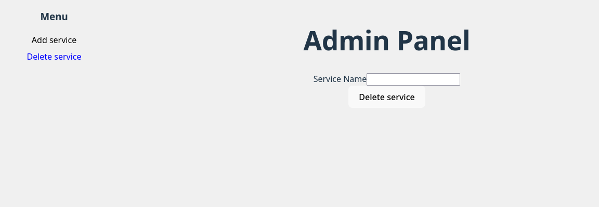

# Emulatv 

Emulatv is a little project for my personal use (but you are free to use it of course :D). It aims to emulate a TV App and make services (such as Netflix, Youtube etc...) accessible. 
I initially had the idea to make it runs on an raspberry Pi but, because it needs to manage the display and use a web browser, i gave up on that restriction (since my own raspebrry is only 1Gb of ram).  
It may work on a more performant raspberry, but it is no longer something i'm aiming for.

Another part of this project is for me to familiarize with full stack web development and deploiement. Thus I chose to architecture everything as micro-services runnable on dockers.

# Warning 

--- DO NOT USE OUTSIDE OF LOCAL NETWORK, NO SECURITY FEATURES ARE IMPLEMENTED YET ---

# How to run

*Make sure you have docker installed on your device.*

Clone the present repository and navigate into the project's folder.

Then, run the run-emulatv script to start, on a linux : 

```sh
chmod u+x run-emulatv.sh
./run-emulatv.sh
```

**Warning** Postgresql uses a docker volume to ensure persistence, make sure not to erase it if you don't want to loose any data.

# How to use

Here is the main UI that runs directly on the micro-controller/pc/whatever you want. Will act as the smartTV. When the service runs, you can access it at [this link](http://localhost/ui/).


You can control it through a web app on you personal phone in the same local network as the TV box, here is the Remote UI.


Available at http://your_computer_ip/remote/

Finally, to add services to you database, visit the (yet to be complete) [admin panel](http://localhost/ui/admin/). You will have to provide an svg image for each service and the link of the service.


