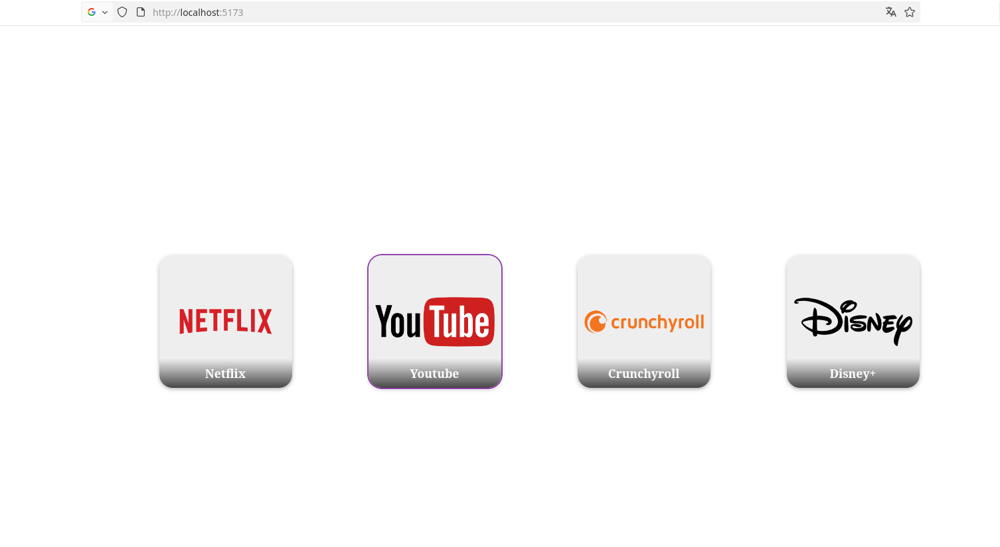
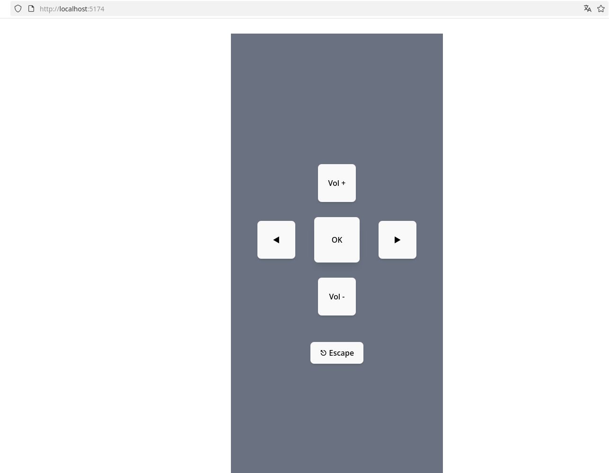

# Emulatv 

Emulatv is a little project for my personal use (but you are free to use it of course :D). It aims to emulate a TV App and made services (such as Netflix, Youtube etc...) accessible. 
I want it to run on a micro controller such as a Raspberry Pi, my personal phone (or any phones within the same network) would act as a tv controller. 

Another part of this project is for me to familiarize with full stack web development and deploiement. 

Here is the main UI that runs directly on the micro-controller/pc/whatever you want. Will act as the TV box.

You can control it through a web app on you personal phone in the same local network as the TV box, here is the Remote UI.

# Warning 

--- DO NOT USE OUTSIDE OF LOCAL NETWORK, NO SECURITY FEATURES ARE IMPLEMENTED YET ---

# How to run

Emulatv will be soon directly available through a dockercompose.